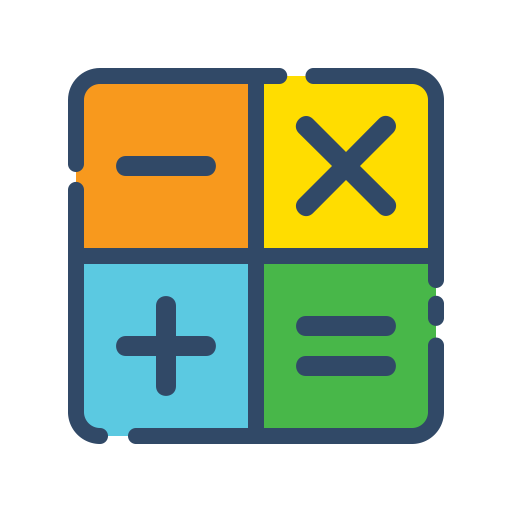
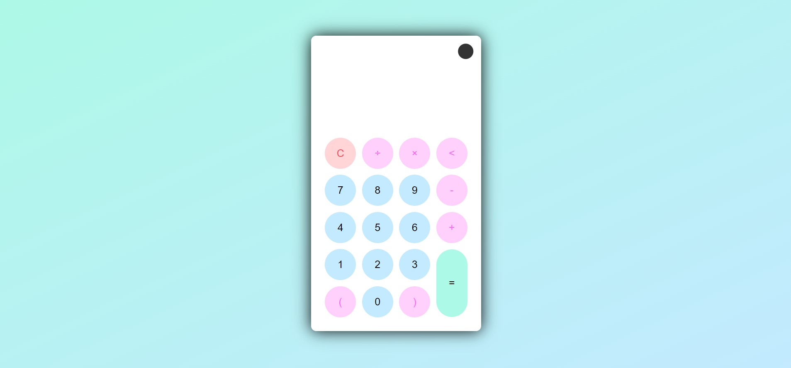
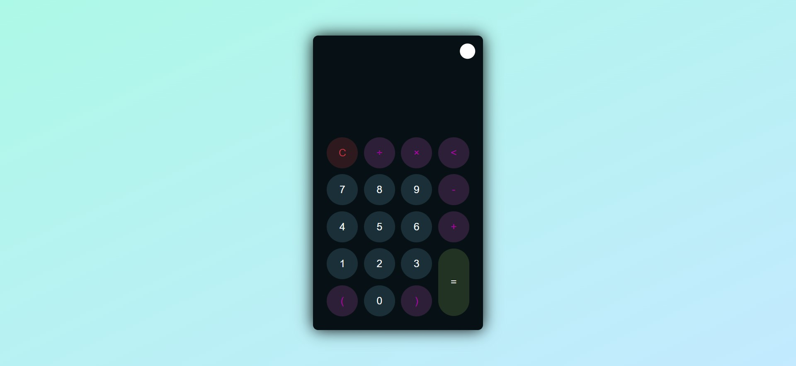

# Calculator Project
---

> A web application that helps students solve mathematical equations

## Description

> This project is an online calculator that helps students to solve mathematical equations such as addition, subtraction, multiplication and division. There are two attributes calculator, dark and light, I hope you like it and thank you

### [Calculator](https://n8wnmgbe5iotkih17tptdw.on.drv.tw/Calcoulator/)

## Development

* [x] **Html 5** 
* [x] **Css 3**
* [x] **Java Script 5**

## ScreenShots

